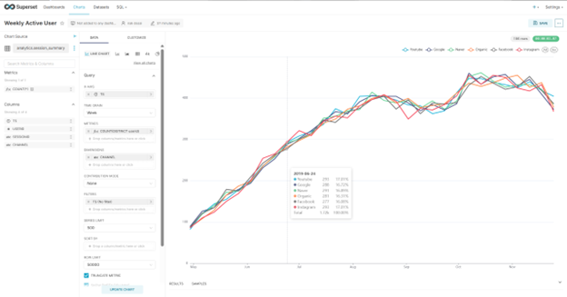

# 📊 WAU Pipeline: Airflow, Snowflake, Superset

This project demonstrates a complete data pipeline to track **Weekly Active Users (WAU)**. It includes:

- Extracting & staging raw session data using **Airflow**
- Transforming into analytics-ready tables with **CTAS and PK/Duplicate checks**
- Visualizing in **Apache Superset (Docker)** connected to **Snowflake**

> 🏁 Completed as part of a Data Pipeline assignment involving Airflow, Snowflake, and a BI Tool (Superset or Tableau).

---

## 📦 Features

- Ingest raw user session data from S3 to Snowflake (`raw.user_session_channel`, `raw.session_timestamp`)
- Create analytics table `analytics.session_summary` via **Airflow ELT DAG**
- Run **primary key** and **duplicate record checks** before table swap
- Build WAU (Weekly Active User) chart from joined table in **Superset**
- Rename metric to **WAU**
- All code and screenshots submitted as per project instructions

---

## 🛠 Tech Stack

- **Apache Airflow** (ETL & ELT orchestration)
- **Snowflake** (data warehouse)
- **Docker** (Airflow & Superset environments)
- **Superset** (BI dashboard + WAU chart)
- **Python + SQL**

---

## 🧰 Setup Instructions

### 1. Clone the Repository

```bash
git clone https://github.com/Nak1106/airflow-snowflake-wau-pipeline.git
cd airflow-snowflake-wau-pipeline
```

### 2. Install Dependencies

```bash
pip install -r requirements.txt
```

### 3. Run Airflow (Docker)

```bash
docker-compose up -d
```

### 4. Configure Airflow

- Add `snowflake_conn` in Airflow UI with credentials.
- Create Airflow Variables if needed.

---

## 📁 Project Structure

| File                      | Description |
|---------------------------|-------------|
| `session_summary.py`      | ELT DAG for CTAS, PK check, dedup, table swap |
| `user_session_channel.py` | ETL DAG to load raw data from S3 |
| `requirements.txt`        | Python dependencies |
| `README.md`               | Project documentation |

---

## 📈 Final Output

### ✔ WAU Chart in Superset

- Built using `analytics.session_summary`
- Grouped by `channel` over weekly `ts`
- Renamed metric to `WAU`
- Shown below:



> 📌 You can find the full-size image in the `/screenshots` folder.

---

## 🧪 Screenshots Checklist

| Screenshot | Description |
|------------|-------------|
| `dag_etl.png` | Airflow UI: ETL DAG loading raw data |
| `dag_elt.png` | Airflow UI: ELT DAG for session_summary |
| `datasets_superset.png` | Dataset view in Superset |
| `preset_wau_chart.png` | Final WAU chart |

---

## 👨‍💻 Author

**Nakshatra Desai**  
Graduate Student – MS Data Analytics @ SJSU  
📫 [LinkedIn](https://www.linkedin.com/in/nakshatra-desai-547a771b6/)

---

## 📌 Repo Summary (for GitHub description)

> End-to-end data pipeline using Airflow, Snowflake, and Superset to build Weekly Active User analytics from raw session data.
